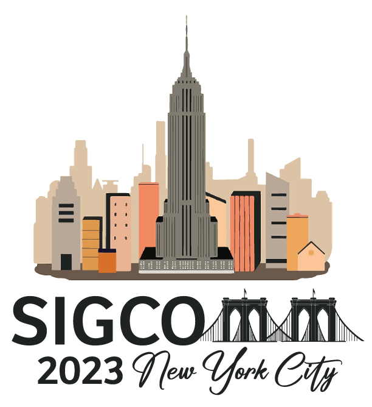

<!-- <h1 style="text-align: center;">1st Workshop on New IP and Beyond</h1> -->

  

    
  

  

    <h1 style="text-align: center; padding-right:40px; line-height:1em;">Enhanced Network Techniques and Technologies for the Industrial IoT to Cloud Continuum </h1>
  

<h4 style="text-align: center;line-height:2em;">10th September 2023, Organized by: ACM Sigcomm 2023</h4>
<h6 style="text-align: center;line-height:0em;">Columbia University, NY, USA</h6>

<h2 style="text-align: center;"> Full Day Workshop Program</h2>
---

<h3 style="color:#C62828; text-align: center;">Keynote Speakers </h3>

---

<h3 style="color:#C66868;">Opening Keynote: Distributed Adaptive Energy Management Solutions for IoT Networks</h3>

<h3 id="okey"> Keynote-I: Prof. K.K. Ramakrishnan </h3>

#### *Prof. K. K. Ramakrishnan*, Distinguished Professor, Dept. of Computer Science and Engineering, University of California, Riverside

Dr. K. K. Ramakrishnan is a Distinguished Professor of Computer Science and Engineering at the University of California, Riverside. Previously, he was a Distinguished Member of Technical Staff at AT&T Labs-Research until 2013. He joined AT&T Bell Labs in 1994 and was with AT&T Labs-Research since its inception in 1996. Prior to 1994, he was a Technical Director and Consulting Engineer in Networking at Digital Equipment Corporation. Between 2000 and 2002, he was at TeraOptic Networks, Inc., as Founder and Vice President. Dr. Ramakrishnan is an ACM Fellow, an IEEE Fellow, and an AT&T Fellow. His work on the "DECbit" congestion avoidance protocol received the ACM Sigcomm Test of Time Paper Award in 2006, and he received the AT&T Technology Medal in 2012 for his work on Mobile Video Delivery. K. K. received his M.E. from the Indian Institute of Science (19100), MS (1981) and Ph.D. (1983) in Computer Science from the University of Maryland, College Park, USA.

#### Abstract
Multi-sensor IoT devices can be used to monitor different environmental phenomena. Often deployed over large areas, these devices depend on batteries and renewable energy sources for power. We develop efficient energy management solutions to maximize device lifetime while ensuring appropriate and sufficient data is captured to be processed by the IoT application. We leverage cooperative sensing with multiple sensors working together to further increase energy efficiency and minimize temporal overlap. We adapt the device load to available renewable energy using Model Predictive Control (MPC) to optimize sensing tasks and develop and evaluate a low-complexity approximation to MPC suitable for execution on IoT devices. Our Predictive EneRgy Management for IoT (PERMIT) is implemented on a prototype lightweight solar-powered IoT device using a Raspberry Pi and multiple sensors, developed along with HP Labs. We then develop cooperative sensing by using a distributed “Block scheduler” scheduler to manage sensing across multiple IoT devices that minimizes temporal sensing overlap across neighboring IoT devices.

This is joint work with Elizabeth Liri, Koushik Kar, Puneet Sharma and Geoff Lyon.
Session chair: Prof. Hans-Peter Bernhard

<h3 style="color:#C66868;">Closing Keynote: Internet of Things Science: The use of IoT Cloud-Data for data exchange, semantic interoperability and device management federation for AI-Industrial Applications</h3>
<h3 id="okey"> Keynote-II: Dr. Martin Serrano</h3>

#### *Dr. Martin Serrano* (Insight SFI Research Centre for Data Analytics, University of Galway)

Dr. Martin Serrano holds an Adjunct Lecturer position at the University of Galway and the role of Guest Lecturer at SCU in Silicon Valley, Santa Clara, CA, USA. He also has delivered Lectures at California State University SLO, CA, USA and TUB, Berlin, and FBK-CREATE Net Research Centre in Trento, Italy. He has a Principal Investigator position within the Insight SFI Research Centre, one of the largest research centers for data analytics in Europe. Dr. Serrano is a recognized expert on Semantic Interoperability for Distributed Systems and Internet of Things design and has also contributed to define the Data Interplay in Edge Computing using the Linked Data paradigm, In both works he has got best paper awards for these Scientific Contributions/Publications. Dr. Serrano has advanced the state of the art on Pervasive Computing using semantic data Modelling and Context Awareness methods to extend the "Autonomics" parading for networking systems. He also has contributed to enrich the Information and Knowledge Engineering area using Semantics and Ontologies for describing data and services relations in Autonomic Computing. Dr. Serrano is a pioneer and visionary researcher proposing that Semantic Technologies applied to Policy-based Management Systems can be used as an approach to produce cognitive applications capable of understanding service and application events, controlling the pervasive services life cycle. Dr. Serrano is the author of the academic book "Applied Ontology Engineering in Cloud Services, Networks and Management Systems" published by Springer USA. Dr. Serrano has experience on Technical Management and Coordination of Irish National (HEA Futurecomm, SFI FAME) and European collaborative Projects (IST CONTEXT, IST AutoI, ICT OpenIoT, ICT OpenIoT-Enlarged, ICT Vital, ICT BIG IoT, ICT ACTIVAGE, H2020 i3-MARKET, and H2020 INFINITECH) and also Experiments in European Platforms (SSCFed4FIRE). Also, he is active research member at the Next Generation Internet (NGI-Explorers and NGI-Enrichers) initiative. He is an active member of IEEE (Computer and Communication Societies)
 and ACM. Dr. Serrano is a continuous contributor for the European Commission DG-CNECT for defining the Research and Innovation Agenda for Europe, acting as an expert and assisting the European Commission in the definition of Horizon Europe, Horizon 2020, and FP9 Horizon Europe programme.

#### Abstract
The Industrial Internet of Things (IIoT) has advanced rapidly, transforming the perception in how data can be stored and processed in order to get the benefits from the collected data in particular industry applications, i.e., preventive maintenance, device production, planning in manufacturing, etc. The Internet of Things Stack has evolved to integrate advanced data management capabilities to cope with the emergent needs in industrial markets, i.e., privacy and security concerns, large amounts of data processing, federated access to information, etc. In this talk, the full IoT Stack will be reviewed, and the data continuum will be explained, starting at the edge of the technology and understanding the IoT data life cycle, from data collection to data marketplaces. The management of the “universally”
connected devices used to be a priority in the Internet of Things. Still, today, this has been “level up” towards managing not only the devices but also the data that the loT platforms and the end-user applications those devices are able to support. The Internet of Things Stack was defined including device management techniques (i.e., autonomic, self- management); that have been developed over the run of these years. Management paradigms are emerging, and is clear that the loT developments have triggered the evolution in different directions, from looking to more powerful devices that process large amounts of data at the Edge to a larger development in the number of interoperable loT platforms where the development of architectures in the cloud and cross-domain applications can use the data seamlessly offering new end-user applications. Therefore, this multidirectional evolution has resulted in the creation of several parallel loT ecosystems, some of them open but the majority proprietary ecosystems. Finally, we will also address the challenges and proposed solutions for the interoperability of these parallel loT ecosystems, the current standard propositions, and the management techniques for the delivery of data services over those loT platforms.

---

<h2 style="color:#C62828;text-align: center;">Very Special Invited Talks</h2>

<h3 style="color:#C66868;">Invited Talk I: Deterministic Reliable Communication in Wireless IIoT </h3>
<h3 id="talk1"> Invited-Talk-I: Dr. Hans-Peter Bernhard </h3>

#### Presenter: Dr. Hans-Peter Bernhard, Head of Research Unit Wireless Communications, Silicon Austria Labs, Austria

Dr. Hans-Peter Bernhard, Principal Scientist, Head of Research Unit Wireless Communications at Silicon Austria Labs , and Senior Scientist at the Institute of Communications and RF Systems at the Johannes Kepler University Linz, Austria. Hans-Peter Bernhard received a Master’s degree in electrical engineering in 1991 and a PhD in Technical Sciences from the Technical University Vienna in 1997. He was Assistant Professor at TU-Vienna until 1998 and joined the JKU as a Lecturer in 1999. In 2014 he started as Senior Scientist at Johannes Kepler University and at Silicon Austria Labs in 2018. He was a Guest Researcher at Prague Academy of Science and at the University of Cambridge. He has given several invited talks on various aspects of wireless factory and sensor communications. He has organized/co-organized several special sessions at ETFA2019, WFCS2020-2023, NOMS2020-2023, IEEE-IM 2021, WF-IoT 2021 and served as conference General Chair WFCS2021, and Organizing Chair of EWSN2022. He is an active member of the IEEE P1451 standard technical committee, IES TC-II, IES TC-FA, IEEE Senior Member and guest editor of IEEE Transactions on Industrial Informatics.

#### Abstract

In this presentation, we examine the current applications of wireless Operational Technology (OT) networks and explore the potential of both 5G and a sneak peek into 6G as wireless communication technologies ready to meet the demanding communication needs of Industry 5.0 applications. We showcase the capabilities of a 5G campus network deployed within indoor factory floor scenarios, leveraging the latest advancements from the commercially available 3GPP release-16.
 By conducting an extensive measurement campaign, we acquire detailed insights into various aspects including coverage maps, reference signal power, channel quality indicators, and throughput. Moreover, we analyze end-to-end delay measurements across different channel conditions, considering 5G quality of service priorities and varying traffic loads. This comprehensive analysis aids in shaping a potential trajectory for the digitalization of industries, ushering in a realm of cyber-physical continuity that necessitates precise communication to enable seamless end-to-end services.
 Drawing from the insights of the EU project DETERMINISTIC6G, we tackle this challenge through a novel architecture that integrates Time-Sensitive Networking (TSN) and Deterministic Networking (DetNet). This architecture also incorporates data-driven network performance awareness and the concept of digital twins to enable determinism and enhance safety within 6G networks. In conclusion, we offer a glimpse into the future by exploring the integration of environmental awareness into communication links. This integration holds the promise of advancing the deterministic and reliable behavior of wireless communication within controlled environments.

<h3 style="color:#C66868;">Invited Talk II: Integration of Machine Learning and Networking Intents for the Orchestration of Distributed IIoT Devices.</h3>

<h3 id="talk2"> Invited-Talk-II: Antonino Angi</h3>

#### Presenter: Antonino Angi, Politecnico di Torino, Italy

Antonio Angi received his M.Sc. degree in Computer Engineering from Politecnico di Torino, Italy, in 2020, and he is currently a Ph.D. student at the same university. His research interests include network architecture and management protocols, machine learning for computer networks, and data-plane programmability.

#### Abstract
“Properly connecting processing nodes with sensors and optimization on physical or wireless layers are two of the goals that Industrial IoT (IIoT) experts are trying to meet, along with high-speed data transmission and scalability for different topologies and needs. But how can we program IIoT devices to achieve low transmission latency while ensuring network operations align with the required traffic load and user intents?
In this talk, we will explore how ML methods can be used in conjunction with data-plane programming languages to efficiently profile network loads while using intents to help administrators and programmers customize their networks according to their needs.”

---
<h2 style="color:#C62828;text-align: center;">List of Accepted Papers and Presentations</h2>

### Paper 1: "FactoryDC: Network and Resource Planning..."
#### Presenter: Marco Reisacher

Bio:Marco is currently pursuing a PhD degree with University of Stuttgart, in
collaboration with Siemens. His research interests include network monitoring, resource management in networks, and machine learning. His recent work looks into network planning for factory networks based on real-world application demands.

### Paper 2: "FabOS: Hooking up Container Platforms..."
#### Presenter: Manuel Eppler
Bio: I studied math and computer science at Tuebingen university. Since 2022, I am a PhD Student at Siemens AG and the chair of communication systems at Tuebingen university.
I am going to present the FabOS architecture: a Kubernetes and Time-Sensitive-Networking-based architecture that provides flexible processing and deterministic networking for future industrial factories.

### Paper 3: SymbIoT: Towards An Extensible Blockchain Integration Testbed for IIoT
#### Presenter: John Hayes, Birmingham City University
Bio: John Hayes is a PhD student at Birmingham City University, UK. His research focusses on the integration and evaluation of blockchain technology for predominantly security-focussed use-cases within the IoT and edge computing domains.

### Paper 4. "Supporting vPLC Networking over TSN with...".
#### Presenter: Lorenzo Rosa
Bio: Lorenzo Rosa is a PhD student at the University of Bologna, Italy. His research focuses on the integration of innovative networking technologies, such as kernel-bypassing and time-sensitive networking, into next-generation edge cloud platforms. In the industrial domain, Lorenzo is exploring the use of modern networking hardware to support the effective integration of Information
Technologies within critical industrial processes.

### Paper 5. “Operation and Control Networks a Systematic approach”
#### Presenter: Kiran Makhijani

Bio: Kiran is Principal Engineer at Futurewei Technologies, USA. Kiran works on Future Networks research and their path to Standards in 5G and B5g context. She is currently working on research and development of data path and control plane mechanisms for Industrial Automation.

### Paper 6. "Context-Aware Attribute Based Access..."
#### Presenter: Kasturi Routray (remote)

Bio:I am currently pursuing my 6th semester of PhD in the
Computer Science and Engineering department at the Indian Institute of
Technology, Bhubaneswar. My research area is "Applied cryptography for
cyber-physical systems". I work on developing lightweight cryptographic
techniques(mainly access control and authorization schemes) for Cyber-Physical
Systems (CPS) Network resources.

### Paper 7. "Improving BLE Fingerprint Radio Maps..”
#### Presenter: Hannah B. Pasandi
Bio: Hannah is a Postdoctoral Fellow Researcher at UC Berkeley's NetSys lab, where she works with Sylvia Ratnasamy and Scott Shenker. Her research interests encompass a wide spectrum of wireless technologies, with a particular focus on Bluetooth, Wi-Fi, LoRaWAN, and Massive-MIMO. Currently, Hannah is deeply immersed in research centered around Privacy Auditing and Mitigations in 5G networks, Satellite Communication, and Wi-Fi technology.

During her Ph.D., she conducted one-of-its-kind framework for designing on-device self-driven communication protocols for next-generation wireless technologies. Her approach involved proposing AI-driven solutions using Reinforcement Learning (RL) and Graph Neural Networks (GNN), which had a profound impact on the development of cutting-edge wireless communication protocols. Hannah's dedication and innovative research continue to shape the future of wireless technology.

----
